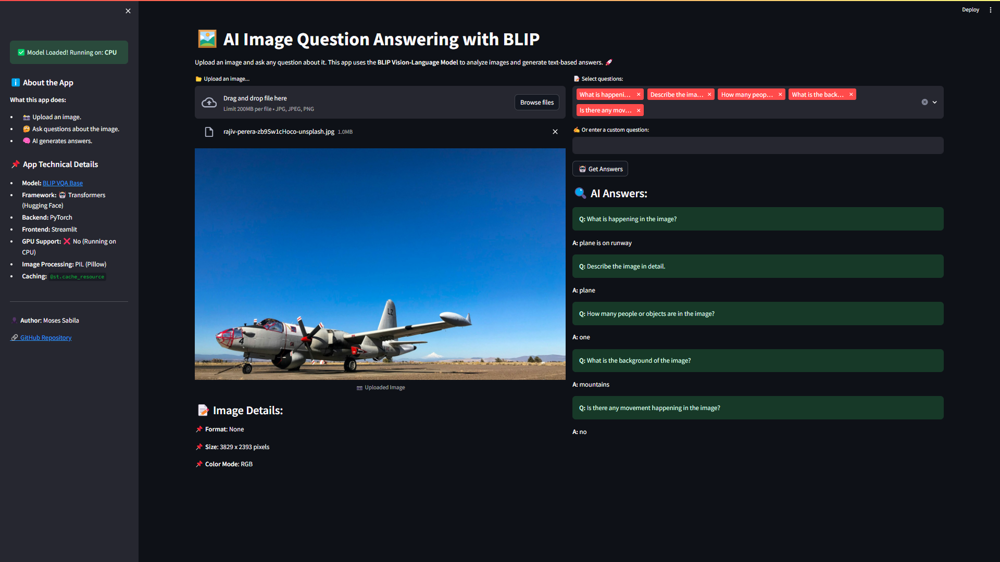

<div align="center"> 
  <h1 align="center">📸 AI-Powered Image Analysis </h1>  
  <h3 align="center">An intelligent image analysis application using BLIP and Streamlit</h3>  
  <p align="center">Upload an image, ask questions, and get AI-powered answers instantly.</p>  

<div>  
      
      
      
  </div>  

  <a href="" target="_blank">  
      
  </a>  
  <br />  


</div>  

---

## 📋 <a name="table">Table of Contents</a>

1. 🤖 [Introduction](#introduction)  
2. ⚙️ [Tech Stack](#tech-stack)  
3. 🔋 [Features](#features)  
4. 🚀 [Quick Start](#quick-start)  
5. 🕸️ [Code Snippets](#snippets)  
6. 🔗 [Links](#links)  
7. 📌 [More](#more)  

---

## <a name="introduction">🤖 Introduction</a>

The **AI Image Question Answering** project is a **deep learning-powered web application** designed to process images and provide meaningful answers to user-posed questions. Built with **Streamlit**, this app leverages **Salesforce’s BLIP (Bootstrapped Language-Image Pretraining) model** to extract relevant insights from images.  

Key functionalities include:  

- **Uploading images (JPEG, PNG) for analysis.**  
- **Asking both predefined and custom questions about the image.**  
- **Generating AI-based answers using the BLIP model.**  
- **Providing real-time inference with GPU acceleration (if available).**  
- **Delivering a seamless and interactive user experience with Streamlit.**  

Whether you're a researcher, developer, or AI enthusiast, this project serves as an excellent **introduction to multimodal AI** and **visual question answering (VQA) applications**.  

---

## <a name="tech-stack">⚙️ Tech Stack</a>

- **Python**  
- **Streamlit**  
- **Hugging Face Transformers**  
- **PyTorch**  
- **PIL (Pillow)**  

---

## <a name="features">🔋 Features</a>

👉 **AI-Powered Image Question Answering**: Upload an image and ask any question related to its content.  

👉 **Predefined Questions for Instant Insights**: Select from a list of commonly asked questions for a quick analysis.  

👉 **Custom Question Input**: Type your own question to get AI-generated responses tailored to your query.  

👉 **Real-Time Processing with AI Feedback**: Experience **instantaneous results** with **dynamic loading indicators** while the AI processes your request.  

👉 **Seamless Streamlit UI**: Intuitive **drag-and-drop** image upload and interactive **question submission** for smooth user experience.  

👉 **Optimized for GPU Acceleration**: The model runs efficiently on CUDA-enabled devices for **faster inference**.  

---

## <a name="quick-start">🚀 Quick Start</a>

Follow these steps to set up and run the project on your local machine.  

### **Prerequisites**  

Ensure you have the following installed:  

- [Python 3.8+](https://www.python.org/downloads/)  
- [pip](https://pip.pypa.io/en/stable/installation/)  

### **Cloning the Repository**  

```bash
git clone https://github.com/your-username/ai-image-question-answering.git
cd ai-image-question-answering
```

### **Installation**  

Install all required dependencies using:  

```bash
pip install -r requirements.txt
```

### **Running the Project**  

```bash
streamlit run streamlit_app.py
```

Open **[http://localhost:8501](http://localhost:8501)** in your browser to interact with the application.  

---

## <a name="snippets">🕸️ Code Snippets</a>

### **1️⃣ Loading the BLIP Model**  

```python
from transformers import BlipProcessor, BlipForQuestionAnswering
import torch

DEVICE = "cuda" if torch.cuda.is_available() else "cpu"

processor = BlipProcessor.from_pretrained("Salesforce/blip-vqa-base")
model = BlipForQuestionAnswering.from_pretrained("Salesforce/blip-vqa-base").to(DEVICE)
```

### **2️⃣ Processing Images and Questions**  

```python
def get_answer(image, question):
    """Processes an image and question to return an AI-generated response."""
    inputs = processor(image, question, return_tensors="pt").to(DEVICE)
    output = model.generate(**inputs)
    return processor.decode(output[0], skip_special_tokens=True)
```

### **3️⃣ Implementing Streamlit UI**  

```python
import streamlit as st
from PIL import Image

st.title("📸 AI Image Question Answering")

uploaded_image = st.file_uploader("Upload an image", type=["jpg", "png"])

if uploaded_image is not None:
    image = Image.open(uploaded_image)
    st.image(image, caption="Uploaded Image", use_column_width=True)

    question = st.text_input("Ask a question about the image:")
    if st.button("Get Answer"):
        answer = get_answer(image, question)
        st.success(f"**Q:** {question}")
        st.write(f"**A:** {answer}")
```

---

## <a name="links">🔗 Links</a>

- 🔗 **Live Demo**: [Try it here](https://theoddysey-visual-answering-transformers-m-streamlit-app-vimg1u.streamlit.app/)  
- 📜 **Project Repository**: [GitHub](https://github.com/your-username/ai-image-question-answering)  
- 📚 **BLIP Model**: [Hugging Face](https://huggingface.co/Salesforce/blip-vqa-base)  

---

## <a name="more">📌 More</a>

🔹 **Future Enhancements**  
- ✅ Improve model inference speed for real-time responses.  
- ✅ Extend support for **OCR-based text recognition**.  
- ✅ Enhance UI with **interactive visualization** options.  

**License**  
This project is **open-source** under the **MIT License**.  

---
 